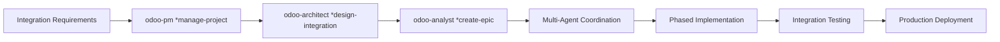
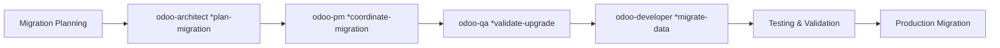

# BMAD-Odoo Agent Usage Guide

## Overview

This guide provides comprehensive scenarios for using BMAD-Odoo agents in different development contexts, from rapid brownfield enhancements to complex multi-module implementations. Each scenario includes step-by-step workflows, agent interactions, and real-world examples.

## Agent Roles Quick Reference

| Agent | Primary Role | When to Use |
|-------|-------------|-------------|
| **odoo-analyst (Sofia)** | Business Analysis & Story Management | Requirements gathering, story creation, business process analysis |
| **odoo-architect (Diego)** | Technical Architecture & System Design | System design, module planning, integration architecture |
| **odoo-developer (Carlos)** | Code Implementation & Deployment | Story implementation, module development, Doodba deployment |
| **odoo-pm (Maria)** | Project Management & Stakeholder Coordination | Project planning, resource management, stakeholder alignment |
| **odoo-qa (Elena)** | Quality Assurance & Testing | Testing strategy, quality validation, test automation |
| **odoo-sm (Alex)** | Scrum Master & Agile Coaching | Sprint management, process improvement, team coordination |

## Scenario 1: Rapid Brownfield Enhancement (2-4 Hours)

**Use Case**: Add a simple field to existing form or implement basic business rule

### Workflow


### Step-by-Step Process

#### 1. Business Analysis (5-10 minutes)
**Agent**: `odoo-analyst` (Sofia)

```bash
# Activate analyst agent
*odoo-analyst

# Create rapid story for small enhancement
*rapid-story

# Provide context:
# - Specific enhancement needed
# - Existing module to modify
# - User impact and business value
```

**Example Input**:
```
Enhancement: Add customer credit limit display on sales order form
Module: sale
Business Value: Sales managers can make informed approval decisions
Users: Sales managers and sales team
Timeline: Same day implementation needed
```

**Expected Output**: Rapid story with clear implementation guidance

#### 2. Development Implementation (1-3 hours)
**Agent**: `odoo-developer` (Carlos)

```bash
# Activate developer agent
*odoo-developer

# For existing module enhancement
*brownfield-enhance

# Follow story implementation:
# - Modify views/sale_views.xml
# - Add readonly field for credit_limit
# - Test functionality
```

**Implementation Steps**:
1. Modify sale order form view
2. Add credit limit field display
3. Test with different customers
4. Validate existing functionality unchanged

#### 3. Quick Deployment (15-30 minutes)
**Agent**: `odoo-developer` (Carlos)

```bash
# Deploy to development environment
*doodba-deploy

# Quick testing workflow:
# 1. Update module in test database
# 2. Verify form displays correctly
# 3. Test with various customer records
# 4. Confirm no existing functionality broken
```

### Success Criteria
- [ ] Enhancement deployed and tested in under 4 hours
- [ ] Existing functionality unchanged
- [ ] Business value delivered immediately
- [ ] No production issues

---

## Scenario 2: New Module Development (1-2 Sprints)

**Use Case**: Create comprehensive new module with complete business workflow

### Workflow


### Step-by-Step Process

#### 1. Requirements Gathering & Analysis (1-2 days)
**Agent**: `odoo-analyst` (Sofia)

```bash
*odoo-analyst

# Create comprehensive functional specification
*create-functional-spec

# Gather detailed requirements:
# - Business processes and workflows
# - User personas and use cases
# - Integration requirements
# - Success criteria and metrics
```

**Key Activities**:
- Stakeholder interviews and requirements workshops
- Business process mapping and analysis
- Gap analysis with standard Odoo functionality
- Functional specification documentation

#### 2. Technical Architecture Design (1-2 days)
**Agent**: `odoo-architect` (Diego)

```bash
*odoo-architect

# Design comprehensive system architecture
*design-architecture

# Create technical specifications:
# - Module structure and dependencies
# - Data model design and relationships
# - Integration patterns and APIs
# - Security model and access controls
```

**Key Deliverables**:
- Technical architecture document
- Database design and model relationships
- Integration specifications
- Security and performance considerations

#### 3. Epic Creation & Story Breakdown (0.5-1 day)
**Agent**: `odoo-analyst` (Sofia)

```bash
*odoo-analyst

# Create development epic from requirements
*create-epic

# Break down into implementable stories
*shard-epic

# Define story priorities and dependencies
*story-prioritization
```

**Epic Components**:
- Business value definition and success metrics
- Story breakdown with clear acceptance criteria
- Implementation phases and delivery timeline
- Risk assessment and mitigation strategies

#### 4. Sprint Planning & Story Management (Ongoing)
**Agent**: `odoo-sm` (Alex)

```bash
*odoo-sm

# Plan development sprints
*plan-sprint

# Create detailed development stories
*draft

# Manage story refinement and estimation
*refine-backlog
```

**Sprint Activities**:
- Story estimation and capacity planning
- Sprint goal definition and commitment
- Daily progress tracking and impediment removal
- Sprint reviews and retrospectives

#### 5. Story Implementation (Per Story: 2-5 days)
**Agent**: `odoo-developer` (Carlos)

```bash
*odoo-developer

# Implement individual stories
*develop-story

# For new modules:
*create-module

# Deploy and test each story
*doodba-deploy
*doodba-test
```

**Development Cycle**:
1. Read and analyze story requirements
2. Implement models, views, and business logic
3. Write comprehensive tests
4. Deploy to development environment
5. Validate against acceptance criteria
6. Update story progress and documentation

#### 6. Quality Assurance & Testing (Ongoing)
**Agent**: `odoo-qa` (Elena)

```bash
*odoo-qa

# Create comprehensive testing strategy
*create-test-strategy

# Validate module functionality
*validate-odoo-module

# Coordinate user acceptance testing
*coordinate-uat
```

**QA Activities**:
- Automated test development and execution
- Integration testing with existing modules
- Performance testing and optimization
- User acceptance testing coordination

### Success Criteria
- [ ] Complete module functionality delivered
- [ ] All acceptance criteria validated
- [ ] Performance and security requirements met
- [ ] User training and documentation completed
- [ ] Production deployment successful

---

## Scenario 3: Complex Integration Project (2-4 Sprints)

**Use Case**: Integrate Odoo with external systems, APIs, or complex business processes

### Workflow


### Step-by-Step Process

#### 1. Project Planning & Coordination (2-3 days)
**Agent**: `odoo-pm` (Maria)

```bash
*odoo-pm

# Manage complex integration project
*manage-project

# Coordinate stakeholders and resources
*coordinate-stakeholders

# Assess risks and plan mitigation
*assess-risks
```

**Project Management Activities**:
- Stakeholder identification and communication planning
- Resource allocation and timeline planning
- Risk assessment and mitigation strategy
- Integration testing and deployment planning

#### 2. Integration Architecture Design (3-5 days)
**Agent**: `odoo-architect` (Diego)

```bash
*odoo-architect

# Design integration architecture
*design-integration

# Plan deployment strategy
*plan-deployment

# Address security and performance
*security-design
*optimize-performance
```

**Architecture Deliverables**:
- Integration patterns and API design
- Data flow and transformation specifications
- Security architecture and access controls
- Performance optimization and scalability planning

#### 3. Epic Creation & Multi-Team Coordination (1-2 days)
**Agent**: `odoo-analyst` (Sofia) + `odoo-sm` (Alex)

```bash
# Analyst creates business epic
*odoo-analyst
*create-epic

# Scrum Master coordinates cross-team dependencies
*odoo-sm
*coordinate-cross-team
*manage-capacity
```

**Coordination Activities**:
- Multi-team dependency mapping
- Cross-functional story creation
- Resource coordination and capacity planning
- Communication and reporting structures

#### 4. Phased Implementation (Multiple Sprints)

**Phase 1: Foundation & Core Integration**
```bash
*odoo-developer
*implement-feature  # Core integration components
*create-module      # Integration module creation
*doodba-deploy      # Development environment testing
```

**Phase 2: Advanced Features & Optimization**
```bash
*odoo-developer
*enhance-existing   # Extend integration functionality
*optimize-performance  # Performance tuning
*write-tests        # Comprehensive test coverage
```

**Phase 3: Production Deployment & Monitoring**
```bash
*odoo-developer
*deploy-system      # Production deployment
*troubleshoot-deployment  # Issue resolution

*odoo-pm
*prepare-go-live    # Go-live coordination
*manage-change      # Change management
```

#### 5. Quality Assurance & Validation (Ongoing)
**Agent**: `odoo-qa` (Elena)

```bash
*odoo-qa

# Test integration points
*test-odoo-integration

# Validate performance
*performance-benchmark

# Coordinate comprehensive testing
*coordinate-uat
```

**QA Focus Areas**:
- Integration point validation and error handling
- Data consistency and transformation accuracy
- Performance under load and stress conditions
- Security validation and penetration testing

### Success Criteria
- [ ] All integration points functioning correctly
- [ ] Data integrity maintained across systems
- [ ] Performance requirements met under load
- [ ] Security and compliance requirements satisfied
- [ ] User training and support documentation complete

---

## Scenario 4: Odoo Version Migration (3-6 Sprints)

**Use Case**: Migrate from older Odoo version to newer version with custom module updates

### Workflow


### Step-by-Step Process

#### 1. Migration Planning & Assessment (1-2 weeks)
**Agent**: `odoo-architect` (Diego)

```bash
*odoo-architect

# Plan comprehensive migration strategy
*plan-migration

# Assess current system and customizations
*research odoo-version-compatibility

# Design migration architecture
*design-architecture
```

**Planning Activities**:
- Current system assessment and customization inventory
- Version compatibility analysis and gap identification
- Migration timeline and resource planning
- Risk assessment and rollback procedures

#### 2. Project Coordination & Risk Management (Ongoing)
**Agent**: `odoo-pm` (Maria)

```bash
*odoo-pm

# Coordinate migration project
*coordinate-migration

# Manage stakeholder communication
*coordinate-stakeholders

# Track progress and manage risks
*track-progress
*assess-risks
```

**Coordination Focus**:
- Multi-stakeholder communication and alignment
- Timeline management and milestone tracking
- Risk monitoring and mitigation execution
- Resource coordination and change management

#### 3. Migration Validation & Testing Strategy (1 week)
**Agent**: `odoo-qa` (Elena)

```bash
*odoo-qa

# Validate migration approach
*validate-upgrade

# Plan comprehensive testing
*create-test-strategy

# Design data validation procedures
*validate-data-migration
```

**Validation Planning**:
- Migration testing strategy and procedures
- Data integrity validation and verification
- Performance testing and optimization
- User acceptance testing coordination

#### 4. Migration Implementation (Multiple Sprints)

**Sprint 1-2: Environment Setup & Core Migration**
```bash
*odoo-developer
*migrate-data        # Core data migration procedures
*plan-deployment     # Migration environment setup
*troubleshoot-deployment  # Environment issues resolution
```

**Sprint 3-4: Custom Module Migration**
```bash
*odoo-developer
*enhance-existing    # Update custom modules for new version
*write-tests         # Update and create migration tests
*review-code         # Code review for version compatibility
```

**Sprint 5-6: Testing & Production Migration**
```bash
*odoo-developer
*deploy-system       # Production migration execution
*optimize-performance  # Post-migration optimization

*odoo-qa
*validate-upgrade    # Comprehensive migration validation
*performance-benchmark  # Performance validation
```

#### 5. Post-Migration Support & Optimization (1-2 weeks)
```bash
*odoo-developer
*debug-issue         # Post-migration issue resolution
*optimize-performance  # Performance tuning and optimization

*odoo-pm
*manage-change       # User adoption and change management
*coordinate-training  # User training and support
```

### Success Criteria
- [ ] All data migrated accurately and completely
- [ ] Custom modules function correctly in new version
- [ ] Performance equals or exceeds pre-migration levels
- [ ] All integrations working correctly
- [ ] Users trained and comfortable with any changes
- [ ] Rollback procedures tested and documented

---

## Scenario 5: Continuous Improvement & Maintenance (Ongoing)

**Use Case**: Ongoing enhancement and maintenance of existing Odoo system

### Workflow


### Ongoing Process

#### Weekly Sprint Planning
**Agent**: `odoo-sm` (Alex)

```bash
*odoo-sm

# Manage continuous improvement sprints
*manage-sprint

# Facilitate backlog refinement
*refine-backlog

# Track team velocity and capacity
*track-velocity
```

#### Rapid Enhancement Processing
**Agent**: `odoo-analyst` (Sofia)

```bash
*odoo-analyst

# Process small enhancement requests
*rapid-story

# Analyze business impact
*analyze-process

# Prioritize based on business value
*story-prioritization
```

#### Continuous Development
**Agent**: `odoo-developer` (Carlos)

```bash
*odoo-developer

# Implement enhancement stories
*develop-story

# Quick addon modifications
*brownfield-enhance

# Regular deployment cycles
*doodba-deploy
```

#### Quality Assurance
**Agent**: `odoo-qa` (Elena)

```bash
*odoo-qa

# Validate each enhancement
*validate-enhancement

# Maintain test automation
*create-test-automation

# Monitor system health
*assess-quality-metrics
```

### Success Criteria
- [ ] Regular enhancement delivery (weekly/bi-weekly)
- [ ] High system availability and performance
- [ ] User satisfaction with continuous improvements
- [ ] Technical debt managed and minimized
- [ ] Knowledge transfer and documentation maintained

---

## Agent Interaction Patterns

### Sequential Pattern (Linear Workflow)
```
odoo-analyst → odoo-architect → odoo-developer → odoo-qa
```
**Use for**: Simple, well-defined enhancements

### Collaborative Pattern (Parallel Work)
```
        odoo-analyst ↔ odoo-architect
              ↓              ↓
        odoo-sm → odoo-developer ← odoo-qa
              ↓
         odoo-pm (coordination)
```
**Use for**: Complex projects requiring coordination

### Iterative Pattern (Agile Cycles)
```
Sprint Planning (odoo-sm) → Story Creation (odoo-analyst) → 
Development (odoo-developer) → Testing (odoo-qa) → 
Review & Retrospective (odoo-sm) → Next Sprint
```
**Use for**: Ongoing development and continuous improvement

---

## Best Practices & Tips

### Agent Selection Guidelines
1. **Start with business need**: Always begin with `odoo-analyst` for requirements
2. **Architecture first**: Use `odoo-architect` for complex technical decisions
3. **Coordinate complexity**: Involve `odoo-pm` for multi-stakeholder projects
4. **Quality throughout**: Engage `odoo-qa` early in complex projects
5. **Process improvement**: Use `odoo-sm` for team workflow optimization

### Communication Tips
- **Be specific** with requirements and context
- **Provide business value** rationale for all requests
- **Include timeline constraints** and priority information
- **Mention integration points** and existing system dependencies
- **Specify target Odoo version** and technical constraints

### Common Pitfalls to Avoid
- Starting development without clear business requirements
- Skipping architecture phase for complex features
- Not involving QA early in complex projects
- Ignoring change management for user-facing changes
- Underestimating integration complexity

### Success Indicators
- Clear business value delivered in each iteration
- Technical debt managed and minimized
- User adoption and satisfaction high
- System performance maintained or improved
- Knowledge transfer and documentation complete

---

## Troubleshooting Guide

### Common Issues and Solutions

#### "Agent doesn't understand my request"
- **Solution**: Provide more specific context and business rationale
- **Example**: Instead of "add field", say "add customer credit limit field to sales order form for approval decisions"

#### "Implementation is too complex for timeline"
- **Solution**: Use `odoo-analyst` `*rapid-story` for smaller scope
- **Alternative**: Break down into multiple stories with `odoo-sm` `*breakdown-epics`

#### "Multiple agents giving conflicting advice"
- **Solution**: Use `odoo-pm` `*coordinate-stakeholders` to align approaches
- **Process**: Establish clear decision-making hierarchy and communication

#### "Quality issues in rapid development"
- **Solution**: Engage `odoo-qa` even for small changes
- **Prevention**: Use quality checklists and automated testing

#### "Integration problems with existing system"
- **Solution**: Use `odoo-architect` `*design-integration` before development
- **Recovery**: Use `odoo-developer` `*troubleshoot-deployment` for resolution

This comprehensive guide provides the foundation for effectively using BMAD-Odoo agents across all common development scenarios, from rapid enhancements to complex implementations.